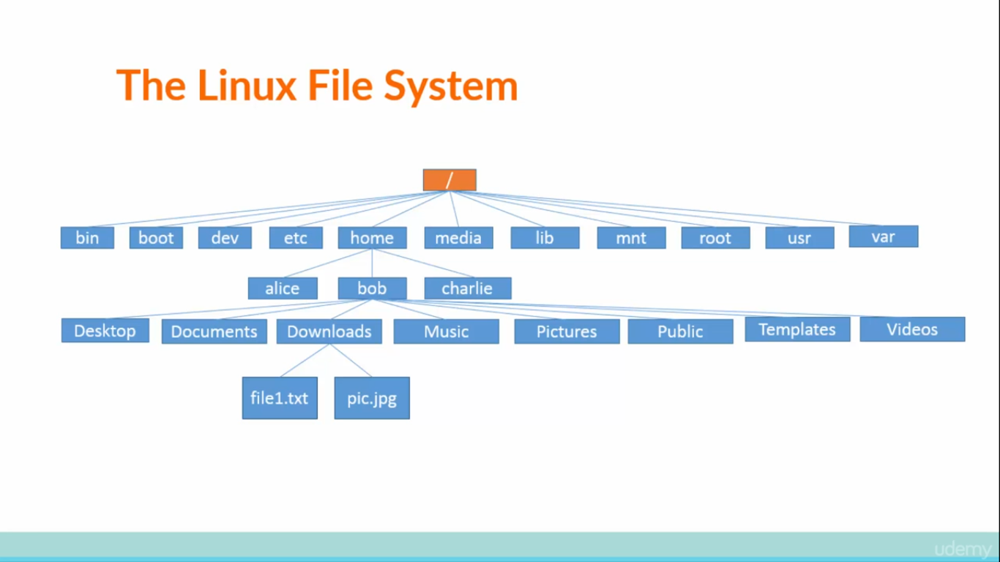

# Filesystem Hierarchy

- Take me to the [Video Tutorial](https://kodekloud.com/courses/873064/lectures/17074387)

In this section, lets take a look at the **`filesystem hierarchy`**
- Linux uses  single rooted, inverted tree like file system
  - **`/home`**  : It is the location that contains the home directories for all users, except the **`root`** user (root user home directory is located at **`/root`**)
  - **`/opt`**   : If you want to install any third party programs put them in the **`/opt`** filesystem.
  - **`/mnt`**   : It is the default mount point for any partition and it is empty by default. It is used to mount filesystems temporarly in the system
  - **`/tmp`**   : It is used to store temporary data
  - **`/media`** : All external media is mounted on **`/media`**
  - **`/dev`**   : Contains the special block and character device files
  - **`/bin`**   : The basic programs such as binaries **`cp`**, **`mv`**, **`mkdir`** are located in the **`/bin`** directory
  - **`/etc`**   : It stores most of the configuration files in Linux.
  - **`/lib`**   : The directory **`/lib`** and **`/lib64`** is the place to look for shared libraries to be imported into your program
  - **`/usr`**   : In older systems, **`/usr`** directory is used for **`User Home Directories`**, however in the modern linux operating systems it is the location where all user land applciations in their data reside
  - **`/var`**   : It contains variable data like mails, log files
  
      
      

      
      
      
 To print all the mounted filesystems, run **`df`** (disk filesystem) command
 ```
 $ df -hP
 ```
 
 
